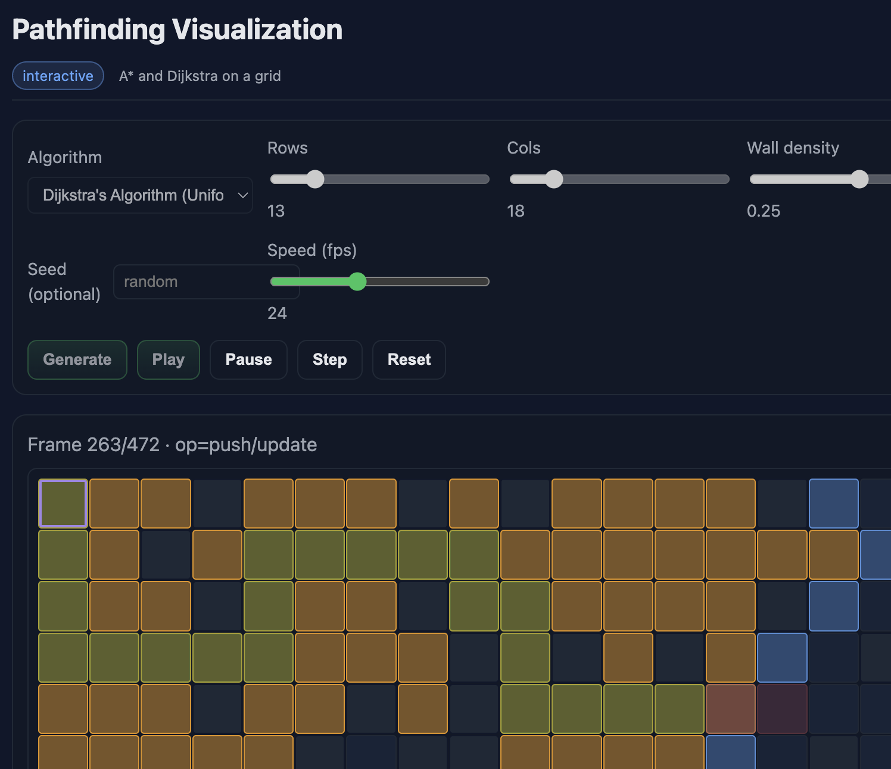

# Python Interview Algorithms Workbook

[](https://github.com/ianlintner/python_dsa/actions/workflows/ci.yml)

Clean, idiomatic Python implementations for senior/staff-level interview prep with complexity notes, pitfalls, demos, and tests.



## Quick Navigation

- [Engineering Study Plan](ENGINEERING_STUDY_PLAN.md) - Structured study guide from Intern to Principal level
- [Algorithms Portfolio](ALGORITHMS_PORTFOLIO.md) - Complete portfolio of algorithm implementations
- [Learning Path](LEARNING_PATH.md) - 2-3 week structured learning plan with checkpoints
- [Consistency Models](CONSISTENCY_MODELS.md) - Distributed systems consistency patterns
- [System Design Guide](INTERVIEW_SYSTEM_DESIGN.md) - Interview system design preparation
- [NeetCode Top 100](NEETCODE_TOP100.md) - Must-know LeetCode problems

## Modules Overview

- **algorithms/sorting** - Comparison (merge, quick, heap, insertion, selection, bubble) and non-comparison (counting, radix)
- **algorithms/searching** - Binary search family, advanced search, selection algorithms
- **data_structures** - Union-Find (DSU), Trie, LRU/LFU caches, Fenwick tree, Segment tree
- **graphs** - BFS/DFS, Topological sort, Dijkstra, A*, Bellman-Ford, Floyd-Warshall, MST, SCC
- **dp** - Fibonacci, coin change, LIS, knapsack, edit distance, bitmask TSP, LCS
- **strings** - KMP, Rabin-Karp, Z-algorithm, Manacher, suffix array/LCP
- **math_utils** - Sieve, GCD/LCM, modular arithmetic, prefix sums
- **patterns** - Sliding window, monotonic stack/queue, two pointers, backtracking
- **systems/concurrency** - Reservoir sampling, rate limiters, consensus notes

## Getting Started

Install (editable) and run tests:

```bash
python -m pip install -U pip
python -m pip install -e .
pytest -q
```

Run demos:

```bash
python src/main.py --list
python src/main.py --demo sorting.merge_sort
python src/main.py --demo searching.binary_search
python src/main.py --demo dp.lcs
python src/main.py --demo graphs.scc
```

## Repository

For the full source code and contributions, visit the [GitHub repository](https://github.com/ianlintner/python_dsa).
